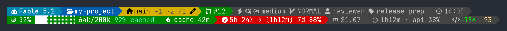

# claude-code-statusline-ps

A PowerShell status line for [Claude Code](https://code.claude.com) on Windows. One script, one small JSON config, a Nerd Font.

[](LICENSE)
[](https://github.com/PowerShell/PowerShell)
[](#requirements)


Left to right: model, context meter, cost, lines changed, rate limits, session badges, the pull
request, folder, and the branch with its change counts. Each segment starts with a Nerd Font icon,
which GitHub cannot show in text, so the rest of this file names the icons instead.



The same data in the two-line powerline layout. Both come from one script; a small JSON file
picks the layout and style.

## About

Claude Code can hand its status bar to any command that reads a JSON payload on stdin and prints a
line. The examples in its docs are bash scripts. This one is PowerShell 7. It needs a Nerd Font and
nothing else, and it installs into your user settings with one command. It shows the numbers you
would otherwise have to go looking for: how full the context window is, what the session has cost,
how close you are to a rate limit, and which modes are on.

## Features

- Context meter with a ten-block bar, percent, and used/total tokens. Green, then yellow, then red. A dim `92% cached` after the counts says how much of the turn's input the prompt cache served, so a number that falls after an edit to a large file tells you why a small turn cost several cents.
- Rate limits for the 5-hour and 7-day windows, with a countdown to the next 5-hour reset, and the spend limit when Claude Code reports one (accounts behind a Claude apps gateway with a spend limit).
- Session cost and lines added or removed.
- Badges for fast mode, extended thinking, effort level, and vim mode, then the custom agent driving the thread and the name given to the session. They disappear when nothing is on.
- The branch's pull request as `#12`, green when approved and red when changes are requested. Ctrl-click it in Windows Terminal to open the PR.
- Folder and git branch, with a home glyph on `main` and a pencil when the tree is dirty. Branch state comes from `git status` in the current directory, cached for a few seconds so most renders never start git.
- Counts beside the branch name: `↑N` `↓N` commits ahead of or behind the upstream, `+N` staged, `~N` changed, `?N` untracked, and a red triangle with a count when files are in conflict. See [Branch counts](#branch-counts).
- A fork glyph and the worktree name beside the branch when the session is in a git worktree, so a window on `wt-review` is not mistaken for the main checkout. See [Worktree name](#worktree-name).
- One line or two, plain separators or powerline blocks, and any segment switched off, all from `statusline.json`.
- A matching line for each running subagent in the agent panel, with `.\install.ps1 -Subagents`. See [Subagent status line](#subagent-status-line).
- Fits the terminal width. A line that is too long first loses detail from the limits, context, branch, folder and badges segments, then loses whole segments from the right, so lines stop wrapping in normal use.
- If a field is missing from the payload, the script drops that segment. If the payload will not parse, it still prints the model glyph.
- Icons come from Unicode code points rather than pasted characters, so the file's own encoding cannot corrupt them.
- No modules to install. PowerShell 7 and a Nerd Font are the whole dependency list.

## Requirements

- Windows 10 or 11
- [PowerShell 7](https://learn.microsoft.com/powershell/scripting/install/installing-powershell-on-windows) on your `PATH` as `pwsh`
- Claude Code
- A [Nerd Font](https://www.nerdfonts.com/) in your terminal. The installer can set up JetBrainsMono Nerd Font for you.
- `git` on your `PATH` if you want the branch segment. Without it the segment is skipped and everything else still renders.

## Installation

```powershell
git clone https://github.com/ookla-ariel-ride/claude-code-statusline-ps
cd claude-code-statusline-ps
.\install.ps1 -InstallFont -ConfigureWindowsTerminal
```

Restart Claude Code, or wait for its next status refresh.

### What the installer does

- Copies `statusline.ps1` to `~/.claude/statusline.ps1`.
- Copies `statusline.json` to `~/.claude/statusline.json` unless one is already there. If the repo copy is missing it warns and carries on. The script has the same defaults built in.
- Adds a `statusLine` entry to your user-level `~/.claude/settings.json`. It keeps every other key and writes a `.bak` copy first.
- Sets `hideVimModeIndicator` inside that entry. The badges segment already shows the vim mode, so Claude Code's own indicator would be the same word twice on one bar.
- With `-RefreshInterval <seconds>`, sets `refreshInterval` inside that entry so Claude Code re-renders the line on a timer as well as on events. Without the switch the key is not written. A value below 1 is refused and nothing is written.
- With `-Subagents`, also copies `subagent-statusline.ps1` to `~/.claude/` and adds a `subagentStatusLine` entry. See [Subagent status line](#subagent-status-line).
- With `-InstallFont`, installs JetBrainsMono Nerd Font through winget. Expect one elevation prompt.
- With `-ConfigureWindowsTerminal`, sets Windows Terminal's default font to `JetBrainsMono NF` and backs up its settings.

The settings entry it writes after `.\install.ps1 -RefreshInterval 10`:

```json
"statusLine": {
  "type": "command",
  "command": "pwsh -NoProfile -NoLogo -NonInteractive -File \"C:/Users/<you>/.claude/statusline.ps1\"",
  "padding": 0,
  "hideVimModeIndicator": true,
  "refreshInterval": 10
}
```

The path uses forward slashes on purpose. Claude Code may run the command through Git Bash, which
strips backslashes. It is double-quoted for the same kind of reason: a profile with a space in it,
such as `C:/Users/Jane Doe`, would otherwise end the `-File` argument at the space. See
[Subagent status line](#subagent-status-line) for the one case the quoting cannot cover.

`refreshInterval` is what keeps a clock, or a taskbar bar driven by the context percentage, moving
between events. Nothing in the line needs it today, so the installer only writes it when asked. A
reinstall without the switch writes an entry without the key. Pass the switch again to keep it.

`-SettingsPath <file>` changes only which settings file is edited. The `statusline.ps1` and
`statusline.json` copies, and the delete on `-Uninstall`, still use `~/.claude`. It exists for the
test suite, which points it into a temp folder.

### Subagent status line

```powershell
.\install.ps1 -Subagents
```

Claude Code shows a panel of the subagents a session is running, and `subagentStatusLine` is a second
command that draws the row for each of them. `subagent-statusline.ps1` prints one short line per
subagent in the same visual language as the main bar: the robot glyph, the agent's name, and how full
its context window is.

```
󰚩 Explore  24%  48k
󰚩 general-purpose  91%  182k
```

The contract is not the one the main status line uses. Claude Code runs the command once for the
whole panel, hands it every live row in a single payload, and expects one JSON object per line back,
`{"id": ..., "content": ...}`, keyed by the task id. So the script loops over `tasks` and answers for
each one. A row that cannot be rendered falls back to the glyph alone; a payload that will not parse
prints nothing, because a bare glyph is not JSON and the panel would only log it and drop it.

The identity is the agent's registered name, or its label, description or type when there is no name.
The progress is the context percentage, coloured green, yellow and red on the same 60 and 85 bands the
context segment uses, 70 and 90 on a 1M window, then the token count. A task with no window size shows
its status word instead. When the payload's `columns` value leaves too little room, the name is
clipped with an ellipsis before any figure is dropped, and the glyph is never dropped, so a row never
wraps the panel. A `columns` of exactly `0` is the panel saying it has no room at all, and nothing is
printed for it; a `columns` that is missing or malformed says nothing about the width, so the row
renders in full and the terminal decides.

There is no config file, no git probe and no powerline style: a panel row is not a full-width bar, and
a git probe per row per tick is too much for something that ticks every five seconds.

The entry it writes:

```json
"subagentStatusLine": {
  "type": "command",
  "command": "pwsh -NoProfile -NoLogo -NonInteractive -File \"C:/Users/<you>/.claude/subagent-statusline.ps1\""
}
```

`padding` and `hideVimModeIndicator` are left out on purpose: the setting's schema is `type` and
`command` only. The path is double-quoted, and so is the one in the `statusLine` entry, because a
profile such as `C:/Users/Jane Doe` would otherwise end the `-File` argument at the space and the
command would never run. Double quotes are the one form both cmd and Git Bash honour, and every
character Windows forbids in a path is one that could break out of them. A `$` or a backtick is legal
in a Windows path and still expands inside Git Bash's double quotes, so the installer warns about
those two rather than writing a command that quietly does the wrong thing.

`tools/capture-stdin.ps1` is there if you want to see a payload for yourself. Point
`subagentStatusLine` at it instead, run a session with a few subagents, and read the file it appends
to. It prints nothing on stdout, so the panel renders as if the key were not set.

It is bounded in three places, because a capture command left in place ticks every five seconds
forever. Stdin is read to a ceiling rather than to the end, so one enormous payload cannot be pulled
into memory whole. The record is then cut to fit `-MaxBytes` (1 MiB by default) on its own, with
` ...[truncated]` marking where. And the file is rotated over a single `.1` sibling when what is
already there plus this record would go over, so each of the two generations stays at or under the cap
rather than one of them ending up above it. The append runs under a lock on a `.lock` sibling so two
ticks cannot interleave a rotation with an append; a tick that cannot get the lock drops its payload.
If a write fails, the reason goes to stderr and to a `.error` sidecar once, and capture stops until
you delete that sidecar.

### Other terminals

Any Nerd Font works. If you run Claude Code inside VS Code, ConEmu, or another terminal, set that
terminal's font to a Nerd Font yourself and skip `-ConfigureWindowsTerminal`.

### Uninstall

```powershell
.\install.ps1 -Uninstall
```

This removes the whole `statusLine` entry, `hideVimModeIndicator` and `refreshInterval` with it, and
deletes `~/.claude/statusline.ps1`. Fonts and `~/.claude/statusline.json` stay.

It removes `subagentStatusLine` and `~/.claude/subagent-statusline.ps1` too, without needing
`-Subagents` again, but only when they are this project's. The subagent line is opt-in, so those two
names may well be something you set up yourself.

The key counts as ours only when the whole `command` is the form the installer writes: `pwsh`, then
only the switches it passes, then `-File`, then exactly one more argument that *is* the path to
`~/.claude/subagent-statusline.ps1`, and nothing after it. A command that merely mentions that path
somewhere — as an argument to a wrapper, in a comment, behind a `&` — is not ours and is kept, because
it never runs our script.

The file counts as ours only when the marker line `# claude-code-statusline-ps:subagent-statusline`
appears as a whole line of its own within the first ten lines. The token turning up inside some other
line, in a string literal or in a trailing comment does not count.

`-Subagents` applies the same rule on the way in: it refuses to install over a
`~/.claude/subagent-statusline.ps1` that is not ours, rather than overwriting it. When it does replace
one of ours it keeps the previous version as `~/.claude/.claude-code-statusline-ps.subagent-rollback.ps1`
— a name carrying this project's id, not a `.bak` beside the script, because a `.bak` is a name your
own tooling might already be using and this file is written and deleted without being asked. Even at
that name the marker is checked before it is overwritten or removed, so a file there that is not ours
survives both a reinstall and an uninstall.

Both entries leave in one write, so `settings.json.bak` still holds them as they were. Every settings
write runs under an exclusive lock on `settings.json.lock`, goes to a uniquely named file beside the
real one, and is then moved over it.

What that gets you, stated no more strongly than it holds. An interrupted or failed write leaves the
previous settings intact rather than a truncated file. The lock serialises this installer against
anything else that takes the same lock, and does nothing about a writer that does not take it, because
a cooperative lock cannot exclude a process that ignores it. The file is compared with what the
installer read twice — when the lock is taken, and again immediately before the rename — so a change
that lands before that second check is refused. A change that lands in the gap between that check and
the rename, which only a writer ignoring the lock can manage, is replaced; the content it replaced is
in `settings.json.bak`. Closing that gap would need a compare-and-swap the filesystem does not offer,
or a lock every writer honours.

## Configuration

The script reads `statusline.json` from its own folder, so after installing that is
`~/.claude/statusline.json`. The installed file holds the defaults:

```json
{
  "layout": "one",
  "style": "plain",
  "folder": "repo",
  "state": true,
  "thresholds": { "warn": 60, "bad": 85 },
  "alarm": { "context": 90, "limits": 90 },
  "icons": {},
  "git": {
    "timeoutMs": 1500,
    "cacheSeconds": 5,
    "cache": true
  },
  "segments": {
    "model": true,
    "context": true,
    "cost": true,
    "lines": true,
    "limits": true,
    "badges": true,
    "pr": true,
    "folder": true,
    "branch": true
  }
}
```

The file leaves `order` and `rows` out on purpose: without them the segments come in the script's own
order, and a segment added by a later release appears on its own. The installer keeps an existing
`statusline.json`, so a file that spells the order out would pin it. `quiet` is left out for the same
reason: every threshold in it defaults to zero, which hides nothing.

A repository can pin its own look. When the payload names a project directory, the script reads
`<project>\.claude\statusline.json` as well and merges it over the user file. The merge is per key, so
a project file of `{"layout": "two"}` keeps every user segment toggle, and one of
`{"segments": {"cost": false}}` turns off cost and leaves the other eight alone. Precedence runs
built-in defaults, user file, project file, and a value the project file gets wrong falls back to the
value beneath it rather than to the built-in default. A project with no `.claude\statusline.json`
changes nothing, and so does an unreadable one. `-Config <path>` is the exception: it replaces the user
file and skips the project file, so a render with it is the same whatever directory the payload names.

That file arrives with the repository rather than from you, so it is read as untrusted input. The file is
opened first and then judged by the handle: a handle that cannot seek is a device or a pipe rather than a
file, and the size that has to fit under 64 KiB is the one the handle reports, not one read off the path
beforehand. A link or another reparse point is refused as well. One clock covers every step — the open,
the size, the link check, each read and the close at the end — and it starts before the first filesystem
call: if 250 ms goes by the attempt is abandoned and the config beneath it stands, silently, the way a
bad value does.

What that buys is a bound on this read, not on the machine. Abandoning is literal: a thread can stay
stuck behind a hung open until the process exits, and a file left open that way is not closed on the way
out, because closing it would wait on the same thing. The status line renders and exits without either.
Two things the bound does not cover, said plainly rather than rounded off: your own `statusline.json` is
read the ordinary way, with no deadline, so a home directory on a dead network share can still hold up a
render; and a filesystem sick enough to hang calls this read never makes can hold one up somewhere else
again. Your file is read that way on purpose — it is yours rather than a repository's, and it is the one
whose text encoding the script does not get to choose.

| Key | Values | What it does |
|---|---|---|
| `preset` | `minimal`, `cost`, `full` | A name for a layout, a style and the whole set of segment toggles, listed below. Every other key in the same file is applied over it, so a preset is a starting point rather than a lock. A name none of the three has, or a value that is not a string, changes nothing. |
| `layout` | `one`, `two` | `two` puts model, folder, branch, pr and badges on the first line and context, limits, cost and lines on the second, unless `rows` says otherwise. |
| `style` | `plain`, `powerline` | `plain` is coloured text with a dim chevron between segments. `powerline` is coloured blocks joined by solid arrows. |
| `folder` | `repo`, `leaf` | `repo` shows `owner/name` from `workspace.repo` when the payload has one, with the current directory's name after a `›` when it differs from the project root. `leaf` always shows the directory name alone. |
| `segments.<name>` | `true`, `false` | `false` hides that segment. The names are the ones in the file above; `segments.pr` is the pull-request link. |
| `state` | `true`, `false` | `false` stops the script writing a state file for the session. |
| `order` | `["model", "branch", "context"]` | The segments of layout `one`, left to right. A segment left out is not shown, an unknown name is skipped, a repeat keeps its first place. Left out altogether, as the installed file leaves it, the segments come in the script's order, new ones included. An empty list, a list naming no segment, or anything that is not a list does the same. |
| `rows` | `[["model", "branch"], ["context", "cost"]]` | The two lines of layout `two`, with the same rules per row. A segment named on the first row is not repeated on the second, and a row may be empty. Left out, the script's own two rows apply, new segments included. Anything but exactly two lists, or two lists naming no segment, does the same. |
| `thresholds` | `{ "warn": 20, "bad": 40 }` | Where the context meter and the rate limits turn yellow and red: whole numbers from 0 to 100 (`20` or `20.0`, not `20.5`), `warn` no higher than `bad`. Either value wrong keeps 60 and 85 for both. A 1M window keeps its own 70 and 90. |
| `alarm` | `{ "context": 90, "limits": 90 }` | Where the model segment itself turns red: `context` is read against `context_window.used_percentage` and `limits` against the higher of the 5-hour and 7-day figures. Whole numbers, each read on its own, so a file naming one leaves the other at 90. `0` turns that alarm off, a negative counts as `0`, and a number above 100 is kept and can then never fire. The spend limit is a billing ceiling rather than a rate and raises no alarm; neither does a percentage that is missing or null, which is what a session sends before its first API response. What is compared is the whole number the segments print, rounded half to even, so the meter and the model can never disagree about whether 90% has been reached: at 89.6 the meter reads 90% and the alarm fires. The alarm reads the percentage whatever the window size, so on a 1M window it fires at the same figure as the window's own fixed 90 band. |
| `quiet` | `{ "cost": 1.00, "context": 30, "limits": 50 }` | The smallest value a segment is worth showing at: dollars for `cost`, percent for `context`, and percent for `limits` against the larger of the 5-hour and 7-day figures (the spend limit is not one of them, and a payload carrying only a spend limit is never hidden here). Below it the segment is not built at all, so it takes no room and has nothing to shed at a narrow width. **Quiet never hides a segment that is carrying a warning or an error**: a context meter or a limits segment already yellow or red stays whatever the threshold says, and so does a 5-hour figure whose pace arrow projects an overrun — which is the case that matters most, because a low percentage early in a window is exactly the one that projects red. `cost` has no warning state of its own, so there its threshold is the whole story. Fractions are allowed, a negative counts as zero, and the test is on the raw figure rather than the printed one, so `"cost": 1.00` hides a cost of 0.996 even though it would have printed `$1.00`. The default is `0` everywhere, which hides nothing; a value that is not a number leaves that one name at `0` and the other two alone. |
| `icons` | `{ "model": "F0E7", "home": "U+2302" }` | Swaps a glyph for the code point given as hex, with `U+` or `0x` and leading zeros allowed in front. Names: `model`, `context`, `cost`, `folder`, `chevron`, `branch`, `worktree`, `home`, `dirty`, `ahead`, `behind`, `conflict`, `pr`, `lines`, `limits`, `fast`, `think`, `effort`, `vim`, `agent`, `session`. A name the list does not have, or a value that is not a single printable glyph, keeps the built-in one. To count as a glyph a code point has to be inside Unicode, not a surrogate half and not a noncharacter, one or two cells wide, and none of: a control (`A` is a newline, `1B` a bare escape), a format character (`202E` is a right-to-left override, `200D` a zero-width joiner), a line or paragraph separator, a space, or a combining mark. Private use is where the Nerd Font glyphs live, so it is allowed. |
| `git.timeoutMs` | `100` to `10000` | How long the branch segment waits for `git status`, in milliseconds, before it gives up and leaves the segment out. A value outside the range is clamped to it. |
| `git.cacheSeconds` | `0` to `300` | How long a `git status` result is reused for, in seconds, before git is asked again. `0` asks git on every render. Clamped like `timeoutMs`. |
| `git.cache` | `true`, `false` | `false` asks git on every render, whatever `cacheSeconds` says. |

### Presets

Turning five segments off by hand is the first edit most people make, so the three usual shapes have
names. The whole file can be `{"preset": "minimal"}`.

| Preset | Layout | Style | Segments on |
|---|---|---|---|
| `minimal` | `one` | `plain` | model, context, folder, branch |
| `cost` | `one` | `plain` | model, context, cost, lines, limits |
| `full` | `two` | `powerline` | all nine |

`minimal` answers which model, how full and where am I, and nothing else. `cost` is the spend line,
for watching a budget or a rate limit. `full` is everything, split across two rows.

A preset is expanded before the rest of the file it appears in, whatever order the keys are written
in, so anything beside it wins: `{"preset": "minimal", "style": "powerline"}` is the minimal segment
set in powerline blocks, and `{"preset": "cost", "segments": {"branch": true}}` is the spend line with
the branch put back. It sets nothing but the layout, the style and the toggles — `order`, `rows`,
`thresholds`, `icons`, `state` and the `git` block are untouched. A preset in a project file sits
where any other project key sits, so it is written over the user file whole; a preset in the user file
is a base for the project file to change.

A config only needs the keys it changes. This one puts the branch beside the model, colours the
meter early and uses a house glyph on `main`:

```json
{
  "layout": "two",
  "rows": [["model", "branch"], ["context", "limits", "cost"]],
  "thresholds": { "warn": 40, "bad": 70 },
  "icons": { "home": "U+2302" }
}
```

A segment that is toggled off, or that the active layout's list does not name (`order` for layout
`one`, `rows` for layout `two`), is not built at all: leave `branch` out and the script never runs
`git status`.

With `badges` off the vim mode is shown nowhere, because the installer sets `hideVimModeIndicator`
and that hides Claude Code's own indicator. If that matters, remove `hideVimModeIndicator` from the
`statusLine` entry in `settings.json` by hand.

Anything missing or invalid falls back to its default without a message, so a typo cannot blank
the status line. Delete the file to get the defaults back. `docs/statusline-two-line.json` is the
config behind the second screenshot.

Every render is a new process that sees only the current payload. So that a later render can tell
what changed, the script keeps one small JSON file per session in `claude-statusline-state` under
your temp folder (`%TEMP%` on Windows, `~/.claude/statusline-state` when there is no temp folder).
The file is named after the session id and holds numbers only: the last cost, input and output token
totals, context and 5-hour usage percentages, and up to twenty timestamped cost readings. No prompt
text, path or file name is written. Files not touched for a day are deleted on a later render.
Nothing on the line uses the file yet. Set `state` to `false` and the script neither reads nor
writes it. Upgrading over an existing `statusline.json` leaves that file alone, so a config without
a `state` key gets the default, which is on. `.\install.ps1 -Uninstall` prints where the files are
so you can delete the folder. The same goes for the `pr` segment: an existing `statusline.json`
without a `pr` key shows it; add `"pr": false` under `segments` to turn it off.

The branch segment keeps the last `git status` answer for each repository in `claude-statusline`
under the same temp folder (`TMPDIR` or the runtime's temp path when there is no `TEMP`), one small
JSON file per repository named by a hash of its path, and reuses it for `git.cacheSeconds` while the
repository's git directory is unchanged: the timestamps of `.git` itself, of `index`, `HEAD`,
`ORIG_HEAD`, `FETCH_HEAD`, `MERGE_HEAD`, `packed-refs`, `logs/HEAD`, `config` and `info/exclude`,
and of every directory under `refs` (up to 256 of them; a repository with more is not cached). A
commit, checkout, add, reset, merge, fetch or push moves one of those, so it shows straight away, and
so does a change to the repository's own config or exclude file; an edit or a new file in the work
tree does not, and neither does a change to your global git config or `core.excludesFile`, so those
can lag by up to five seconds. A worktree or a submodule, where `.git` is a file, is cached under its own
path, with its main repository's refs counted too. A `git status` that failed or timed out is
remembered for the same lifetime, so a slow repository pays the wait once per lifetime, not once per
render. A `statusline.json` from before this cache has no `git` block and gets the defaults: the
cache on, five seconds, a 1.5 second timeout. Add `"git": { "cache": false }` to turn it off.

Claude Code tells the script the terminal width. When a line is too long the script shortens it in
two stages:

1. Detail comes off five segments, in this order: from limits, every figure but the one that drives
   its colour (the worst one when the segment is yellow or red, otherwise the first one present) plus
   the countdown and the pace arrow; the token counts from context; every count from the branch; the
   owner and directory name from the folder, which keeps only the repository name; and the agent and
   session badges, which leaves the mode badges.
2. Whole segments go, from the right: lines, badges, cost, limits, pr, folder, branch, context.

The model segment always stays.

When no segment can be built at all — a payload with nothing in it, or an `order` naming only
segments the payload cannot fill — the script prints the model glyph and the word `claude` in place
of the model segment. The same line stands in when Claude Code sends something that is not JSON at
all. Both follow the same two keys the model segment itself does: with `"segments": {"model":
false}`, or with an `order` or `rows` that leave `model` out, there is no model segment to stand in
for and the script prints nothing. A `statusline.json` that cannot be parsed leaves the built-in
defaults, which do show the line, so a broken config still says something. An empty line is not an
empty session: the state file is written from the payload either way, so a config that shows nothing
still records what the session spent.

## What each segment shows

| Segment | Icon | Data | Rendering |
|---|---|---|---|
| model |  `nf-md-robot` | `model.display_name`, `context_window.context_window_size`, `exceeds_200k_tokens`, `context_window.used_percentage`, `rate_limits.five_hour`, `seven_day` | Bold cyan. On a 1M window `1M` follows the name in a lighter cyan, then a warning triangle when Claude Code reports `exceeds_200k_tokens` as true. The whole segment turns red once the context window or a rate limit reaches the `alarm` percentage, 90 unless the config moves it. The text does not change. This is the one segment that is never shortened and never dropped, which is why the alarm rides on it: at any width, and on either row of layout two, a full context window is still visible as a red line |
| context |  `nf-md-memory` | `context_window.*` | Percent, ten-block bar, used/total tokens, then a dim `92% cached`. Green below 60%, yellow below 85%, red above, or the `thresholds` from the config. On a 1M window the cut-offs are 70% and 90% whatever the config says, so red still means about 100k tokens left. The cached share is `cache_read_input_tokens` over the whole of `current_usage`, absent on older Claude Code versions and before the first API response, and it goes when the token counts go. A block with a negative count is refused rather than repaired, so a malformed payload shows no share instead of a made-up one |
| cost |  `nf-md-cash` | `cost.total_cost_usd` | Dimmed, two decimals |
| lines |  `nf-fa-code` | `cost.total_lines_added`, `total_lines_removed` | `+N` green, `−N` red. Hidden when both are zero |
| limits |  `nf-fa-tachometer` | `rate_limits.five_hour`, `seven_day`, `spend_limit` | `5h 24% → (1h12m) 7d 41% $ 62%`. Coloured by the worst of the figures, with the 60% and 85% bands, or the config's `thresholds`, whatever the window size. The countdown is omitted once the reset time has passed. The arrow after the 5-hour figure paces it against how much of the five-hour window has gone: `→` while carrying on at this rate still lands inside the window, `↑` once it would overrun, and a red `↑` once the projection reaches 120%. There is no arrow in the first half hour of a window, where the projection swings on a single busy minute, nor after the reset time, nor before anything has been used. Only the 5-hour figure gets one; a week is too long to pace from one payload. The `$` figure is the spend limit. Claude Code sends it only behind a Claude apps gateway with a spend limit, and only from 2.1.251 on |
| badges |  fast,  thinking,  effort,  vim,  agent,  session | `fast_mode`, `thinking.enabled`, `effort.level`, `vim.mode`, `agent.name`, `session_name` | Dimmed glyphs. The four mode badges come first, then the custom agent driving the main thread and the name given to the session, which change far less often. Effort is hidden at `high`. A name wider than 20 cells is cut and ends in `…`, measured in cells so a name in wide characters is cut where it draws rather than where it counts. The short form is the mode badges alone, so a narrow line sheds the agent and the session before the whole segment goes. The segment is hidden when none of the six is there, which now includes a plain unnamed session with every mode off. `session_id` is not shown: it is a UUID and says nothing at a glance |
| pr |  `nf-oct-git_pull_request` | `pr.number`, `pr.url`, `pr.review_state` | `#12`, wrapped in an [OSC 8 hyperlink](https://gist.github.com/egmontkob/eb114294efbcd5adb1944c9f3cb5feda) to `pr.url` so ctrl-click in Windows Terminal opens it. Green when the review state is `approved`, red on `changes_requested`, dim otherwise. Hidden when the payload has no `pr` object or no whole, positive number in it; a `url` that is not `http` or `https` leaves the text unlinked |
| folder |  `nf-fa-folder_open` | `workspace.repo`, `workspace.project_dir`, `workspace.current_dir` | Blue. `owner/name` when the payload names the repository, then `›` and the directory name when it differs from the project root. Without a repository, the directory name alone. The short form is the repository name |
| branch |  on `main`/`master`,  elsewhere,  `nf-md-source_fork` in a worktree,  when dirty | `git status --porcelain=v1 --branch` run in `workspace.current_dir`, `worktree.name`, `worktree.path`, `workspace.git_worktree` | Magenta when clean, yellow with the pencil when the tree has changes. The worktree name follows the branch name, then the counts described below, then the pencil. Shows `detached` on a detached HEAD |
| separator |  in `plain`,  in `powerline` | none | Dim chevron between segments, or a solid arrow coloured to blend the neighbouring blocks |

A dim  separates the segments in plain
style; powerline style joins the coloured blocks with a solid
. The icon images are SVG outlines
extracted from JetBrainsMono Nerd Font by `docs/render-icons.ps1`, because
GitHub cannot render the font itself. Icon names are from the
[Nerd Font cheat sheet](https://www.nerdfonts.com/cheat-sheet). Field names follow the
[Claude Code status line reference](https://code.claude.com/docs/en/statusline).

### Branch counts

Claude Code's payload carries no git data, so the script runs one `git status` in the working
directory and reads everything below from its output. A count of zero is left out, so a clean,
synced branch shows only the icon and the name.

| Marker | Meaning | Notes |
|---|---|---|
| `↑N` | Commits ahead of the upstream | Hidden when the branch has no upstream or the upstream is gone |
| `↓N` | Commits behind the upstream | Same |
| `+N` | Staged files | |
| `~N` | Files changed in the work tree | Modified, deleted, type-changed, or added with `git add -N`. A file that is staged and then edited again counts in both `+N` and `~N` |
| `?N` | Untracked entries | Git reports a new directory as one entry, however many files it holds |
| `nf-fa-exclamation_triangle` `N` | Files in conflict | Red, so it stands out |

The counts render dim, in that order, after the branch name and before the pencil. If the line is
too wide for the terminal they are the third thing shed, after the limits and context detail and
before any whole segment goes, leaving the icon, the name and the pencil.

The `git status` call is the one the script already made for the pencil, so the counts cost no
extra process. If a payload does include a `git` object with `branch` and `status`, as the test
samples do, the script reads the branch and the four file counts from it instead and shows no
arrows. A `git` object with an empty branch name shows nothing.

### Worktree name

When the session is in a git worktree, the branch segment carries a fork glyph
( `nf-md-source_fork`) and the worktree's name
after the branch name, so the segment reads branch glyph, `feature/x`, fork glyph, `wt-review`, then
the counts and the pencil. Sessions outside a worktree print what they always printed.

The name comes from the payload, not from git, so it costs no extra work: `worktree.name` when
Claude Code sends one, otherwise the last segment of `worktree.path` when `workspace.git_worktree` is
true. In a worktree that gives neither, the glyph stands on its own. The name goes through the same
guard as the branch and repository names: a directory named with an escape sequence in it is refused
outright, and the invisible characters that reorder a line rather than break it - a right-to-left
override, a directional isolate, a zero-width joiner - are taken out of the name instead, so one of
them costs the character and not the badge. A name with nothing visible left in it is not a name, and
falls through to the path leaf, then to the glyph on its own, the same as a blank one.

The badge is not in the segment's short form. On a narrow line it is shed with the counts, leaving
the icon, the branch name and the pencil, before any whole segment is dropped. `segments.branch` in
`statusline.json` turns the badge off with the rest of the segment; there is no key of its own,
because the name only ever appears beside a branch.

## Test without Claude Code

`test.ps1` runs six groups. Unit checks call the script's helper functions directly (width
measurement, config parsing, the segment table, rendering, width fitting, the context meter, the
limits, `git status` parsing, the payload counts, the branch and pr segments, the state file, the
git cache). The git group runs the branch fallback against temporary repositories: clean, dirty,
unborn, detached, one commit ahead, one behind, a mixed tree with a staged, a modified and an
untracked file, a fake `git` that fails and one that hangs, then the cache end to end: a second
render with a failing `git` on `PATH`, a fetch from a bare remote, a push, a worktree. The state
group writes and reads session files in a temp folder. The install group runs `install.ps1` with
`USERPROFILE` and `-SettingsPath` pointed into a temp folder: a fresh settings file, an existing one
with unrelated keys, `-RefreshInterval`, a refused value, and `-Uninstall`. It checks afterwards
that the real `~/.claude` files were not touched. The subagent group pipes every payload in
`samples/subagent/` through `subagent-statusline.ps1` and reads the replies the way the panel does:
each line must be an object with a string `id` and a string `content`, every id must belong to a task
in the payload, every row must be one line carrying the robot glyph, and it must fit the payload's
`columns` down to a single column. It also checks that malformed, empty, array-shaped and
task-less payloads print nothing and still exit 0, and that the helpers `subagent-statusline.ps1`
copies out of `statusline.ps1` are still the same text in both files. Its own install cases run
`install.ps1 -Subagents` and `-Uninstall` against a second temp home. The ownership rules are checked
against the forms that must not count as ours as well as the ones that must: a command that carries
the path as a wrapper argument or in a trailing comment, one with something chained after it, one
using `-Command`, and a file where the marker token appears only inside another line, in a string
literal, in a trailing comment or below the header window. Beyond that: an install over a file that is
not ours is refused and changes nothing, a profile whose path holds a space and an `&` produces a
command that really runs under cmd, a settings write that cannot complete leaves the old file intact
and no temporary file behind, a file changed between the read and the write is refused, a second
installer holding the lock makes this one write nothing, a `subagent-statusline.ps1.bak` and a file at
the rollback name that this project did not write both survive a reinstall and an uninstall, and the
capture helper bounds a single payload larger than its own cap. The render matrix pipes every payload in
`samples/` through the script for each of seven configs (both layouts and styles, model only, a
reversed `order`, swapped `rows`) at each width:

```powershell
.\test.ps1                                # full run, about three minutes
.\test.ps1 -Columns 80                    # one width instead of 120, 60, 20 and unset
.\test.ps1 -Config .\statusline.json      # one config instead of the seven
.\test.ps1 -Raw                           # show ANSI escapes as <ESC>
```

Every render must exit 0 with nothing on stderr, print the number of lines its layout allows, and fit
the terminal width. At a set width a segment with a short form (limits, context, branch, folder,
badges) must be whole, shortened, or gone, never half shed. At the unset width the matrix also checks
content: each segment the sample and config enable must appear on its row, in the configured order,
with its glyph and value, disabled segments must not, and the separators must match the style. Those
content checks only run when `-Columns` includes `0`, which the default does. A few renders after the
matrix run with no `-Config` at all: they point a payload at a temp project directory and check that
its `.claude\statusline.json` reaches the line, that a broken one does not, and that `-Config` ignores
it. The script exits non-zero if any check fails. Each render takes about 400 ms, nearly all of it
`pwsh` start-up.

The tests never touch your own repositories. They point `GIT_CEILING_DIRECTORIES` at the temp
folder and pass an empty global git config, so the results do not depend on the machine.

To try a payload of your own:

```powershell
Get-Content my-payload.json -Raw | pwsh -NoProfile -File .\statusline.ps1
Get-Content my-payload.json -Raw | pwsh -NoProfile -File .\statusline.ps1 -Config .\docs\statusline-two-line.json
Get-Content .\samples\subagent\01-two-agents.json -Raw | pwsh -NoProfile -File .\subagent-statusline.ps1
```

## Customise

Segment order, the two rows, the colour cut-offs and the glyphs are `statusline.json` keys, described
under Configuration. What is left sits at the top of `statusline.ps1`:

- `Get-IconDefault` holds the built-in code point of every glyph, under the name the `icons` key takes. The [Nerd Font cheat sheet](https://www.nerdfonts.com/cheat-sheet) lists alternatives.
- How long the branch segment waits for `git status` is `git.timeoutMs` in `statusline.json`, not a constant in the script.
- `$defaultEffort` is the level at which the effort badge is hidden.
- The 70% and 90% cut-offs of a 1M window are passed by the context block to `Get-ThresholdRole`; `thresholds` does not move them. The `alarm` percentages are separate from both: `Test-AlarmState` reads the payload directly, so it does not care about the window size or about which segments are switched on.
- `Get-WholePercent` is the one rule that turns a payload figure into the percentage on the line. The context meter, the limits figures, the cached share, the colour bands and the alarms all go through it, so a fractional percentage cannot print as 90% in one segment and count as 89% in another. It rounds half to even, which is what the casts it replaced already did. The cached share is computed from token counts rather than read as a percentage, and it still goes through the same rule: it prints beside the meter's own percentage, and two rounding rules on one segment is the disagreement this function exists to rule out.
- `Get-Palette` holds the colours for both styles.
- `Get-SegmentRegistry` is the segment table. Its array order is the default `order`, `Row` and `RowRank` give the default `rows`, and `ShrinkRank` and `DropRank` set the fitting order, which the config does not change.

## Troubleshooting

Icons show as boxes or question marks: the terminal font is not a Nerd Font. Set it to
`JetBrainsMono NF` or any other Nerd Font.

The status line is blank: run `.\test.ps1` to confirm the script works, then check that `pwsh` is on
your `PATH` and that the `command` path in `settings.json` exists.

No branch segment: the script runs `git status` in the session's working directory. Check that
`git` is on your `PATH` and that the directory is inside a repository. If `git status` takes longer
than 1.5 seconds the segment is skipped for that refresh; `git.timeoutMs` in `statusline.json`
raises the limit for a large repository or a slow disk.

The branch segment is a few seconds behind: that is the cache. The last `git status` answer for
each repository sits in `%TEMP%\claude-statusline\` and is reused for five seconds unless something
under `.git` changes (a commit, checkout, add, reset, merge, fetch or push all count, and so does an
edit to `.git/config` or `.git/info/exclude`), so an edit or a new file in the work tree, or a change
to your global git config or `core.excludesFile`, can take up to five seconds to show.
`git.cacheSeconds` shortens the window, `0` or `"cache": false` turns it off. The folder is safe to
delete at any time; the next render writes it again, and entries not written for a day are swept.

No arrows after the branch name: the branch has no upstream, or the upstream branch was deleted.
`git branch -u origin/<branch>` sets one.

`?1` for a folder full of new files: git reports an untracked directory as a single entry. The
count is of entries, not files.

The line still wraps: the script measures width with a small approximation. Wide glyphs or emoji
in a folder or branch name can be counted short on some terminals. At very narrow widths the model
segment prints even when it does not fit.

Colours look wrong: the script assumes a dark terminal theme.

Nothing to go on: the git probe, the probe cache and the state file swallow every failure, so a
missing branch segment or a cache that never seems to hit leaves nothing behind to look at. Set
`CLAUDE_STATUSLINE_DEBUG` to `1` and each swallowed failure, each cache hit and miss, and each state
read and write appends a line to `claude-statusline-diag.log` in your temp folder:

```text
2026-09-03T09:14:02.118Z 24880 git cache: miss (no entry yet)
2026-09-03T09:14:02.402Z 24880 git probe: git exited 128
2026-09-03T09:14:02.415Z 24880 state: written (C:\Users\jim\AppData\Local\Temp\claude-statusline-state\abc.json)
```

The printed line is the same either way, and a log that cannot be written is as silent as the failure
it records. The log rolls over into `claude-statusline-diag.log.1` once it would pass 4 MB, so
leaving the variable set costs two files of that size at most. Treat the 4 MB as approximate: the log
is best-effort and never waits on anything, so two renders that overlap can leave the file a little
over the cap, or lose one of their lines to each other. Unset the variable when you are done (`0`,
`false`, `no` and `off` also count as off) and delete both files.

## Contributing

Issues and pull requests are welcome. Before opening a PR:

```powershell
.\test.ps1
Install-Module PSScriptAnalyzer -Scope CurrentUser
Get-ChildItem *.ps1 | ForEach-Object { Invoke-ScriptAnalyzer -Path $_.FullName -Settings .\PSScriptAnalyzerSettings.psd1 }
```

The analyzer settings exclude the Write-Host rule, which a status line cannot avoid, and the
positional-parameters rule, because the script and its tests call their own small helpers
positionally. If you add a segment or a sample, add a payload to `samples/` and give it a row in the
`$sampleSegments` and `$sampleMarkers` tables in `test.ps1` (which segments it shows, and the glyph
and value to look for). A sample without those rows fails the run by name. A sample with a segment
that has a short form, such as a branch with counts or a folder with a repository, also needs an
entry in `$sampleShortForms`, the full and shortened text the matrix accepts at a set width, unless
its full text carries a live countdown or cannot fit at 120 columns, as sample 06's limits line does.
A sample whose percentages reach the `alarm` level needs its name in `$alarmSamples` as well: the
markers are plain text and cannot see a colour, so that list is what tells the matrix whether the
model segment should be red or cyan, and it checks both.
Then regenerate the screenshots at the top of this file with
`pwsh docs/render-screenshot.ps1` and
`pwsh docs/render-screenshot.ps1 -Config docs/statusline-two-line.json -Out docs/statusline-two-line.png`.

Commits are scanned for secrets with [gitleaks](https://github.com/gitleaks/gitleaks), both in CI
and through a pre-commit hook. To enable the hook in your clone:

```powershell
winget install Gitleaks.Gitleaks
git config core.hooksPath .githooks
```

## Roadmap

Done so far:

- [x] Query git directly for branch and dirty state
- [x] Optional two-line layout and powerline style
- [x] Ahead and behind counts on the branch
- [x] Staged, changed, untracked and conflict counts on the branch
- [x] `1M` marker and past-200k warning on the model segment, wider colour bands for a 1M window
- [x] Spend limit beside the rate limits
- [x] `owner/name` in the folder segment
- [x] Installer switch for the refresh interval
- [x] Per-session state file, so a later render can see what changed
- [x] Pull-request segment with a clickable link
- [x] Segment order, rows, colour cut-offs and glyphs as `statusline.json` keys
- [x] Cached `git status` with a configurable timeout
- [x] Optional diagnostics log behind `CLAUDE_STATUSLINE_DEBUG`
- [x] Pace arrow on the 5-hour rate limit
- [x] Per-project `statusline.json` merged over the user file
- [x] A subagent status line for the agent panel, installed with `-Subagents`
- [x] Named presets: `minimal`, `cost` and `full` under one `preset` key
- [x] Worktree name beside the branch

[Issues #2 to #43](https://github.com/ookla-ariel-ride/claude-code-statusline-ps/issues) hold what comes next,
each with its own plan. In rough order: new segments (cache warmth, cost per turn, session
clock, links on the folder and branch), and finally an ASCII style that
needs no Nerd Font and a light palette.

## License

MIT. See [`LICENSE`](LICENSE).
